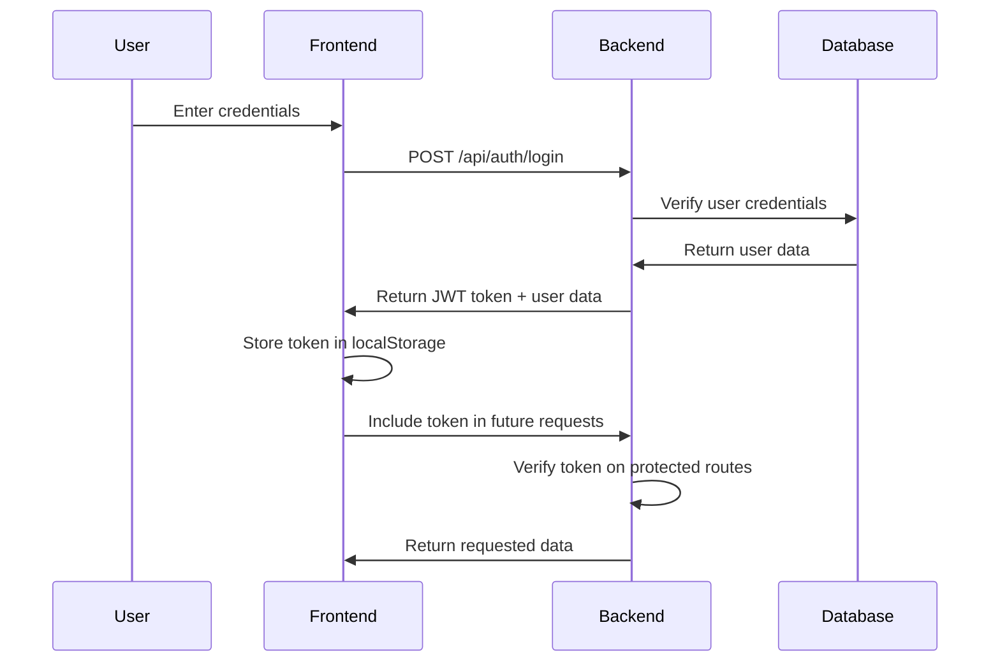
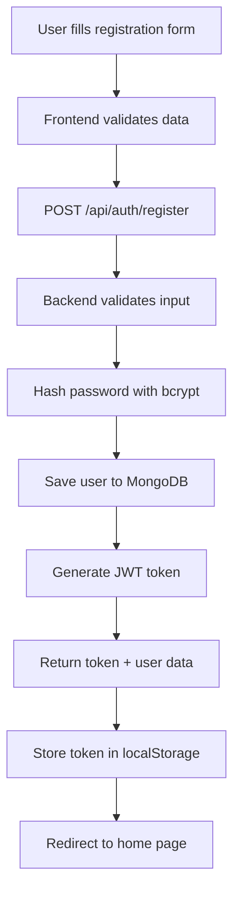
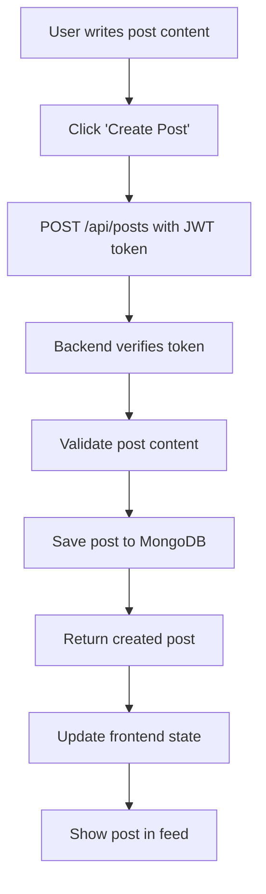
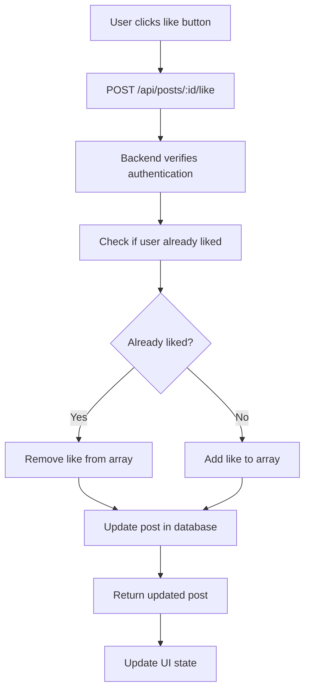

# 🌐 Social Media Platform - MERN Stack

A comprehensive social media platform built with the MERN stack, featuring user authentication, post management, and social interactions. This project serves as an excellent learning resource for understanding full-stack web development.

## 📋 Table of Contents

- [🎯 Project Overview](#-project-overview)
- [🏗️ Architecture & Tech Stack](#️-architecture--tech-stack)
- [🔧 Backend Fundamentals](#-backend-fundamentals)
- [📊 Database Design](#-database-design)
- [🛣️ API Endpoints](#️-api-endpoints)
- [🔐 Authentication System](#-authentication-system)
- [⚡ Installation & Setup](#-installation--setup)
- [🚀 Running the Application](#-running-the-application)
- [📱 Frontend Components](#-frontend-components)
- [🔄 Data Flow & Workflow](#-data-flow--workflow)
- [🧪 Testing](#-testing)
- [🚀 Deployment](#-deployment)
- [📚 Learning Resources](#-learning-resources)
- [🤝 Contributing](#-contributing)
- [📄 License](#-license)

---

## 🎯 Project Overview

This social media platform demonstrates modern web development practices using the MERN stack. It includes:

### ✨ Key Features
- **User Authentication**: Secure registration and login with JWT tokens
- **Post Management**: Create, read, update, and delete posts
- **Social Interactions**: Like posts, add comments, follow/unfollow users
- **User Profiles**: Comprehensive user profiles with social statistics
- **Real-time Updates**: Dynamic content updates without page refresh
- **Responsive Design**: Works seamlessly on desktop and mobile devices

### 🎓 Learning Objectives
- Understanding RESTful API design
- Implementing secure authentication
- Working with NoSQL databases (MongoDB)
- Building responsive React applications
- Managing application state with Context API
- Implementing CRUD operations

---

## 🏗️ Architecture & Tech Stack

### Backend Stack
```
┌─────────────────┐    ┌─────────────────┐    ┌─────────────────┐
│   React.js      │    │   Express.js    │    │   MongoDB       │
│   Frontend      │◄──►│   Backend API   │◄──►│   Database      │
│   Port: 3000    │    │   Port: 5000    │    │   Port: 27017   │
└─────────────────┘    └─────────────────┘    └─────────────────┘
```

### Technology Breakdown

#### 🔧 Backend Technologies
- **Node.js**: JavaScript runtime environment
- **Express.js**: Web application framework
- **MongoDB**: NoSQL document database
- **Mongoose**: MongoDB object modeling library
- **JWT**: JSON Web Tokens for authentication
- **bcryptjs**: Password hashing library
- **CORS**: Cross-Origin Resource Sharing middleware

#### 🎨 Frontend Technologies
- **React**: JavaScript library for building user interfaces
- **React Router**: Client-side routing
- **Axios**: HTTP client for API requests
- **Context API**: State management solution
- **CSS3**: Styling and responsive design

---

## 🔧 Backend Fundamentals

### What is a Backend?
The backend is the server-side part of a web application that handles:
- **Data Processing**: Business logic and data manipulation
- **Database Operations**: Storing and retrieving data
- **Authentication**: User verification and authorization
- **API Endpoints**: Interfaces for frontend communication
- **Security**: Protecting sensitive data and operations

### Express.js Server Structure

```javascript
// server.js - Main server file
const express = require('express');
const mongoose = require('mongoose');

const app = express();

// Middleware
app.use(express.json());        // Parse JSON requests
app.use(cors());               // Enable CORS
app.use('/api/auth', authRoutes);  // Route mounting

// Database Connection
mongoose.connect(MONGODB_URI);

// Start Server
app.listen(PORT, () => {
  console.log(`Server running on port ${PORT}`);
});
```

### Middleware Concept
Middleware functions are executed in sequence and can:
- **Modify requests/responses**: Parse data, add headers
- **Execute code**: Logging, authentication checks
- **End request-response cycle**: Send responses or pass to next middleware
- **Call next middleware**: Continue the chain

```javascript
// Authentication middleware example
const authenticateToken = (req, res, next) => {
  const token = req.headers['authorization'];
  if (!token) return res.status(401).json({ message: 'Access denied' });
  
  // Verify token and add user to request
  req.user = verifiedUser;
  next(); // Continue to next middleware
};
```

---

## 📊 Database Design

### MongoDB Collections

#### 👤 Users Collection
```javascript
{
  _id: ObjectId,
  username: String (unique),
  email: String (unique),
  password: String (hashed),
  firstName: String,
  lastName: String,
  bio: String,
  followers: [ObjectId],    // Array of user IDs
  following: [ObjectId],    // Array of user IDs
  createdAt: Date,
  updatedAt: Date
}
```

#### 📝 Posts Collection
```javascript
{
  _id: ObjectId,
  content: String,
  author: ObjectId,         // Reference to User
  likes: [ObjectId],        // Array of user IDs who liked
  comments: [{
    user: ObjectId,         // Reference to User
    content: String,
    createdAt: Date
  }],
  createdAt: Date,
  updatedAt: Date
}
```

### Database Relationships
- **One-to-Many**: User → Posts (one user can have many posts)
- **Many-to-Many**: User ↔ User (followers/following relationship)
- **One-to-Many**: Post → Comments (one post can have many comments)

---

## 🛣️ API Endpoints

### Authentication Routes (`/api/auth`)
```
POST   /register     - Create new user account
POST   /login        - Authenticate user
GET    /me           - Get current user profile
PUT    /profile      - Update user profile
```

### Posts Routes (`/api/posts`)
```
GET    /             - Get all posts (paginated)
GET    /:id          - Get single post
POST   /             - Create new post
PUT    /:id          - Update post
DELETE /:id          - Delete post
POST   /:id/like     - Like/unlike post
POST   /:id/comment  - Add comment to post
```

### Users Routes (`/api/users`)
```
GET    /             - Get all users (paginated)
GET    /:id          - Get user profile
GET    /search/:username - Search users
POST   /:id/follow   - Follow user
POST   /:id/unfollow - Unfollow user
GET    /:id/followers - Get user's followers
GET    /:id/following - Get users being followed
```

### API Response Format
```javascript
// Success Response
{
  "message": "Operation successful",
  "data": { /* response data */ }
}

// Error Response
{
  "message": "Error description",
  "error": "Detailed error information"
}
```

---

## 🔐 Authentication System

### JWT (JSON Web Token) Flow



### Token Structure
```javascript
// JWT Payload
{
  "userId": "64a1b2c3d4e5f6789abcdef0",
  "iat": 1640995200,    // Issued at
  "exp": 1641600000     // Expires at (7 days)
}
```

### Password Security
```javascript
// Password hashing with bcryptjs
const saltRounds = 12;
const hashedPassword = await bcrypt.hash(password, saltRounds);

// Password verification
const isValid = await bcrypt.compare(password, hashedPassword);
```

---

## ⚡ Installation & Setup

### Prerequisites
- **Node.js** (v14 or higher) - [Download](https://nodejs.org/)
- **MongoDB** (v4.4 or higher) - [Download](https://www.mongodb.com/try/download/community)
- **Git** - [Download](https://git-scm.com/)

### Step-by-Step Setup

#### 1. Clone the Repository
```bash
git clone https://github.com/piyush290106/social-media-platform.git
cd social-media-platform
```

#### 2. Environment Configuration
```bash
# Copy environment template
cp env.example config.env

# Edit config.env with your values
nano config.env  # or use any text editor
```

**Environment Variables:**
```env
# MongoDB Connection
MONGODB_URI=mongodb://localhost:27017/social_media

# JWT Secret (generate a strong secret)
JWT_SECRET=your_super_secret_jwt_key_here

# Server Configuration
PORT=5000
NODE_ENV=development
```

#### 3. Install Dependencies
```bash
# Install backend dependencies
npm install

# Install frontend dependencies
cd client
npm install
cd ..
```

#### 4. Start MongoDB
```bash
# Windows
net start MongoDB

# macOS (Homebrew)
brew services start mongodb-community

# Linux
sudo systemctl start mongod
```

---

## 🚀 Running the Application

### Development Mode (Recommended)

#### Option 1: Run Both Services Together
```bash
npm run devcon
```
This command runs both backend and frontend concurrently.

#### Option 2: Run Services Separately

**Terminal 1 - Backend:**
```bash
npm run dev
```

**Terminal 2 - Frontend:**
```bash
cd client
npm start
```

### Production Mode
```bash
# Build frontend
cd client
npm run build
cd ..

# Start production server
npm start
```

### Access Points
- **Frontend**: http://localhost:3000
- **Backend API**: http://localhost:5000/api
- **API Test**: http://localhost:5000/api/test

---

## 📱 Frontend Components

### Component Architecture
```
src/
├── components/
│   ├── Header.js          # Navigation and user menu
│   ├── Home.js            # Main feed with posts
│   ├── Login.js           # User login form
│   ├── Register.js        # User registration form
│   ├── Post.js            # Individual post component
│   ├── CreatePost.js      # Post creation form
│   ├── Profile.js         # User's own profile
│   └── UserProfile.js     # Other users' profiles
├── context/
│   └── AuthContext.js     # Authentication state management
└── App.js                 # Main application component
```

### State Management with Context API
```javascript
// AuthContext.js - Global authentication state
const AuthContext = createContext();

export const AuthProvider = ({ children }) => {
  const [user, setUser] = useState(null);
  const [token, setToken] = useState(localStorage.getItem('token'));
  
  const login = async (email, password) => {
    // Login logic
  };
  
  const logout = () => {
    // Logout logic
  };
  
  return (
    <AuthContext.Provider value={{ user, login, logout }}>
      {children}
    </AuthContext.Provider>
  );
};
```

### HTTP Client Configuration
```javascript
// Axios configuration for API requests
axios.defaults.baseURL = 'http://localhost:5000/api';
axios.defaults.headers.common['Authorization'] = `Bearer ${token}`;
```

---

## 🔄 Data Flow & Workflow

### User Registration Flow


### Post Creation Flow


### Like/Unlike Flow


---

## 🧪 Testing

### Manual Testing Checklist

#### Authentication
- [ ] User registration with valid data
- [ ] User registration with invalid data
- [ ] User login with correct credentials
- [ ] User login with incorrect credentials
- [ ] Protected route access without token
- [ ] Protected route access with valid token
- [ ] Token expiration handling

#### Posts
- [ ] Create post with valid content
- [ ] Create post with empty content
- [ ] Edit own post
- [ ] Edit another user's post (should fail)
- [ ] Delete own post
- [ ] Delete another user's post (should fail)
- [ ] Like/unlike posts
- [ ] Add comments to posts

#### Social Features
- [ ] Follow other users
- [ ] Unfollow users
- [ ] View followers list
- [ ] View following list
- [ ] Search for users

### API Testing with Postman
```bash
# Test registration
POST http://localhost:5000/api/auth/register
Content-Type: application/json

{
  "username": "testuser",
  "email": "test@example.com",
  "password": "password123",
  "firstName": "Test",
  "lastName": "User"
}
```

---

## 🚀 Deployment

### Deploy to Heroku

#### 1. Prepare for Production
```bash
# Install Heroku CLI
npm install -g heroku-cli

# Login to Heroku
heroku login
```

#### 2. Create Heroku App
```bash
# Create new app
heroku create your-app-name

# Set environment variables
heroku config:set MONGODB_URI=your_mongodb_atlas_uri
heroku config:set JWT_SECRET=your_production_jwt_secret
heroku config:set NODE_ENV=production
```

#### 3. Deploy
```bash
# Add Heroku remote
heroku git:remote -a your-app-name

# Deploy
git push heroku main
```

### Deploy Frontend to Vercel

#### 1. Build Frontend
```bash
cd client
npm run build
```

#### 2. Deploy to Vercel
```bash
# Install Vercel CLI
npm install -g vercel

# Deploy
vercel --prod
```

### MongoDB Atlas Setup
1. Create account at [MongoDB Atlas](https://www.mongodb.com/atlas)
2. Create new cluster
3. Get connection string
4. Update `MONGODB_URI` in environment variables

---

## 📚 Learning Resources

### Backend Development
- [Express.js Documentation](https://expressjs.com/)
- [MongoDB University](https://university.mongodb.com/)
- [Node.js Best Practices](https://github.com/goldbergyoni/nodebestpractices)
- [JWT.io](https://jwt.io/) - JWT token debugger

### Frontend Development
- [React Documentation](https://reactjs.org/docs/)
- [React Router Guide](https://reactrouter.com/)
- [Axios Documentation](https://axios-http.com/)

### Full-Stack Concepts
- [RESTful API Design](https://restfulapi.net/)
- [HTTP Status Codes](https://developer.mozilla.org/en-US/docs/Web/HTTP/Status)
- [CORS Explained](https://developer.mozilla.org/en-US/docs/Web/HTTP/CORS)

### Security
- [OWASP Top 10](https://owasp.org/www-project-top-ten/)
- [JWT Security Best Practices](https://auth0.com/blog/a-look-at-the-latest-draft-for-jwt-bcp/)
- [Password Hashing](https://auth0.com/blog/hashing-in-action-understanding-bcrypt/)

---

## 🤝 Contributing

We welcome contributions! Please follow these steps:

### 1. Fork the Repository
```bash
git clone https://github.com/piyush290106/social-media-platform.git
cd social-media-platform
```

### 2. Create Feature Branch
```bash
git checkout -b feature/amazing-feature
```

### 3. Make Changes
- Write clean, well-commented code
- Follow existing code style
- Test your changes thoroughly

### 4. Commit Changes
```bash
git add .
git commit -m "feat: add amazing feature"
```

### 5. Push and Create Pull Request
```bash
git push origin feature/amazing-feature
```

### Contribution Guidelines
- Use clear commit messages
- Update documentation if needed
- Add tests for new features
- Follow the existing code style

---

## 📄 License

This project is licensed under the MIT License - see the [LICENSE](LICENSE) file for details.

---

## 🙏 Acknowledgments

- Express.js team for the amazing framework
- MongoDB team for the powerful database
- React team for the incredible UI library
- All contributors who help improve this project

---

**Happy Coding! 🚀**

*Built with ❤️ using the MERN stack*